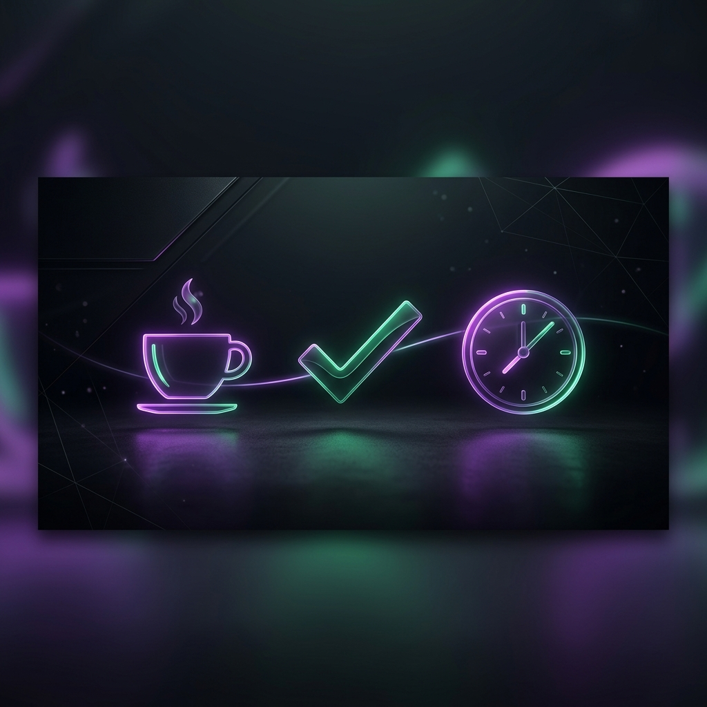

# Obel ⚡
### *The Intelligent Productivity Ecosystem.*

Obel is a minimalist, premium productivity companion designed for deep focus, deliberate habit building, and caffeine-managed flow. Built with a **privacy-first, local-first** philosophy, Obel ensures your data remains yours while providing a world-class user experience.

---

## 🚀 The Obel Experience

Obel is built around six core modules that work in harmony to elevate your productivity:

### 🧘 Focus Hub (Pomodoro)
*   **Deep Work Timer**: Customizable Pomodoro, Short Break, and Long Break sessions.
*   **Ambient Sync**: Persistent global timer that stays visible as you navigate the app.
*   **Session Metrics**: Automatically track your focus minutes and build your "Focus History".

### 📋 Task Management
*   **Intelligent Lists**: Organize work into IMP (Important), Fast, and Later tiers.
*   **Subtask Orchestration**: Break complex goals into small, actionable victories.
*   **The Vault (Archive)**: To keep your mind clear, completed tasks are moved to a searchable Archive in your Profile.

### 📓 Notes & Knowledge
*   **Markdown Editor**: A beautiful, typography-focused space for your thoughts.
*   **Dynamic Templates**: Instant layouts for *Daily Journaling*, *Meeting Notes*, and *Project Briefs*.
*   **Visual Organization**: Pin important thoughts and categorize them with a curated color system.

### 🌿 Habit Mastery
*   **Momentum Tracking**: Monitor your consistency with streaks and completion heatmaps.
*   **Gamified Rewards**: Maintain streaks to unlock **Premium Themes** and level up your productivity badge.
*   **Audio-Visual Bliss**: Experience satisfying haptic and auditory feedback for ogni achievement.

### 📅 Smart Planner & Calendar
*   **Timeblocking**: Drag and drop tasks onto a 24-hour timeline to intentionally schedule your day.
*   **Calendar Sync**: A holistic view of your due dates and scheduled events.

### ☕ The Coffee Hub (Brew)
*   **Caffeine Tracking**: Log your coffee consumption and visualize its impact on your focus metrics.
*   **Dosage Analysis**: Keep track of your daily caffeine levels for peak physiological performance.

---

## 🔥 Advanced DX (Designer Experience)

### 🔄 Global Undo System (Redo)
Accidentally deleted a note? Checked off a task too early? Obel features a **6-second safety window** for every destructive action. A global toast appears instantly, allowing you to **Redo** and restore your data perfectly.

### 📈 Deep Analytics
Visualize your productivity journey with beautiful charts. Analyze your focus trends, task velocity, and habit consistency over weeks and months.

### 🎨 Premium Aesthetics
Obel features a bespoke design system with several achievement-based themes:
*   **Emerald**: Calming nature-inspired greens.
*   **Midnight**: Deep, restorative blues.
*   **Dracula**: The quintessential high-contrast dark mode.
*   **Nord**: A clean, arctic-inspired aesthetic.

---

## 🛠 Multi-Device & Privacy

### 🔒 Local-First, Always.
Obel is designed to be **completely private**. All your tasks, notes, and metrics are stored locally in your browser. No trackers, no telemetry, no mandatory cloud.

### ☁️ Optional MockAPI Sync
For those who want cross-device sync without the big-tech baggage, Obel supports an optional **MockAPI** backup:
1.  Set your `VITE_API_URL` and `VITE_HABITS_API_URL` in your environment.
2.  Obel will optimistically sync your data whenever a connection is available.
3.  **Resilient Sync**: Failed syncs are handled silently, ensuring your local experience is never interrupted by network noise.

---

## 📂 Project Architecture

```
src/
├── components/
│   ├── dashboard/     # AI Coach, Metrics, Hubs
│   ├── layout/        # AppLayout, Global Undo Toast
│   ├── ui/            # UI components + LevelUp Modal
├── lib/
│   ├── api.ts         # Resilient Sync & Local-First logic
│   └── sounds.ts      # Audio-visual haptic system
├── pages/
│   ├── DashboardPage.tsx  # Overview & Coach
│   ├── TasksPage.tsx      # Core productivity board
│   ├── PlannerPage.tsx    # Timeblocking via Drag-and-Drop
│   ├── AnalyticsPage.tsx  # Metric visualizations
│   └── ProfilePage.tsx    # Archive Vault & Achievements
└── stores/
    ├── taskStore.ts   # Sync & Local Persistence
    ├── coffeeStore.ts # Caffeine & Focus correlation
    ├── noteStore.ts   # Markdown state & templates
    └── toastStore.ts  # Global Redo/Undo state
```

## 🌍 Getting Started
1. `npm install`
2. `npm run dev`
3. Elevate your life.

Build your legacy with Obel.
